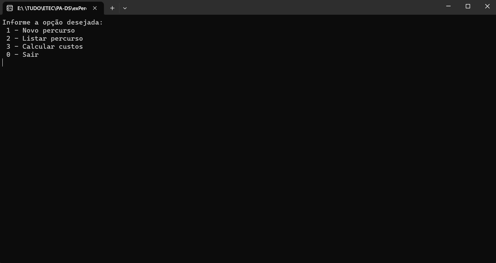

<h1 align="center"> Projeto Percurso - C# </h1>

Projeto de C# Criado durante o Curso Desenvolvimento de Sistemas na Etec Albert Einstein.

---

 

  

---
## 💻 Tecnologias

Esse projeto foi desenvolvido com as seguintes tecnologias:

- C#
- Visual Studio
- Git e Github

---

## 🚧 Projeto

Projeto em C# em que o usuário entra com o Tamanho do Percurso, Valor do Combustível, e Valor do Pedágio, calculando o valor total da Viagem.

Para Ver e Testar esse Projeto você precisa baixar e rodar no Visual Studio.

--- 
